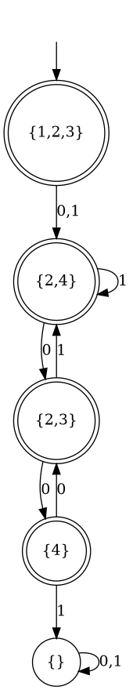
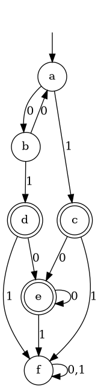

# rextra

At the moment, rextra can display DFAs and NFAs using Graphviz,
convert between NFAs and DFAs, and minimize DFAs.

The representation of DFAs and NFAs assumes an infinite alphabet:

* DFA states always contain a default transition (marked with `*` in
  the visualisations), which is taken if the current token doesn't
  appear in any of the other transitions.

* NFA transitions either apply to a set of tokens, or to all tokens
  *except* a specified set. In the visualisation, the character `Σ`
  denotes the alphabet of tokens.

## Example NFA-to-DFA conversion

This example ghci session converts the NFA shown on the
[wikipedia article about the powerset construction](https://en.wikipedia.org/wiki/Powerset_construction)
into a DFA, using the aforementioned powerset construction.

The conversion assumes that tokens other than `0` and `1` may appear
in the input. Because of this, the resulting DFA looks different from
the one on wikipedia.

``` haskell
>>> Just a = nfa [ (1,[(only "0",2)],[3]), (2,[(only "1",2),(only "1",4)],[]), (3,[(only "0",4)],[2]), (4,[(only "0",3)],[]) ] (1::Int) [3,4]
>>> saveDotAsPng "nfa.png" $ nfaToDot a
```

``` haskell
>>> saveDotAsPng "dfa.png" $ dfaToDot $ nfaToDfa a
```


## Example DFA minimization

This example ghci session minimizes the DFA shown on the
[wikipedia article about DFA minimization](https://en.wikipedia.org/wiki/DFA_minimization).

Transitions for the token `1` are specified explicitly (where
necessary), while transitions for the token `0` are represented by the
default transition marked with `*`.

``` haskell
>>> Just a = dfa [ ("a",[('1',"c")],"b"), ("b",[('1',"d")],"a"), ("c",[('1',"f")],"e"), ("d",[('1',"f")],"e"), ("e",[('1',"f")],"e"), ("f",[],"f") ] "a" ["c","d","e"]
>>> saveDotAsPng "dfa.png" $ dfaToDot a
```

``` haskell
>>> saveDotAsPng "dfa_minimized.png" $ dfaToDot $ minimizeDfa a
```

